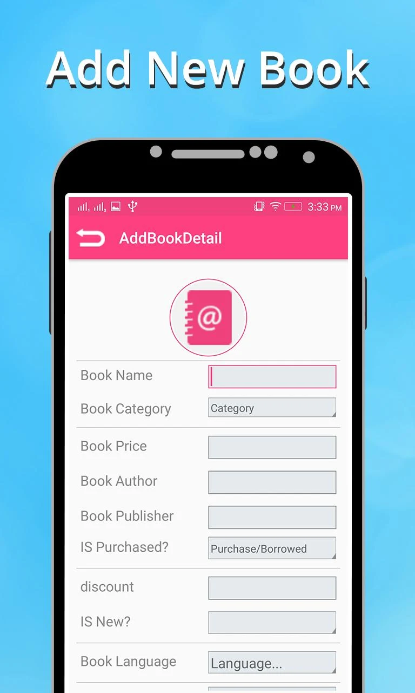
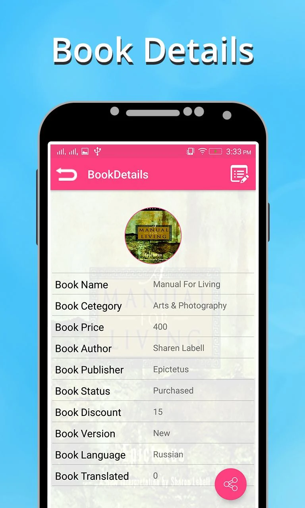
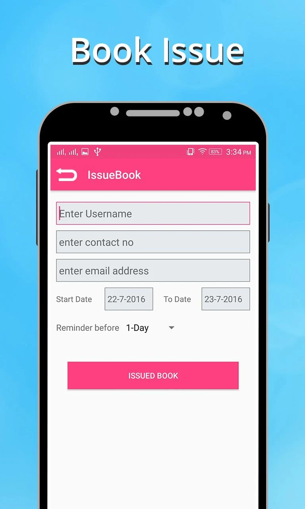
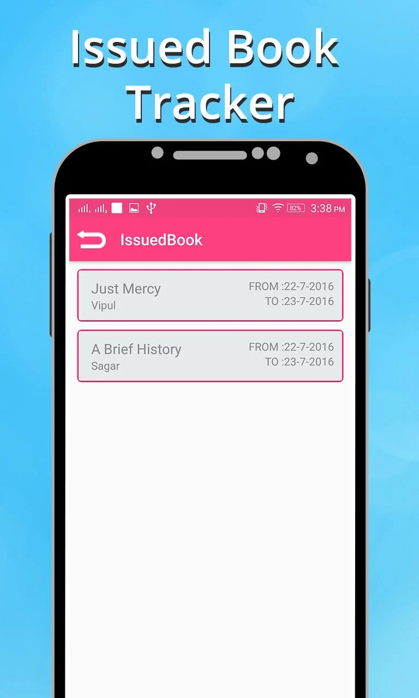
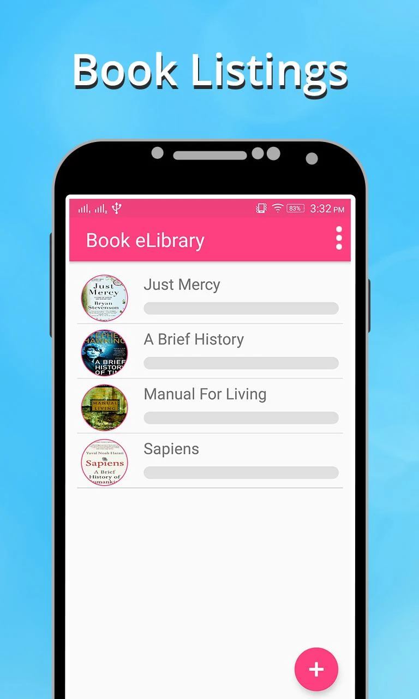

# DixitaDobariya

# Dixita Dobariya

With 5+ years of hands-on experience in Android app development, I specialize in crafting robust and user-friendly mobile applications. Proficient in Java and Kotlin, I've successfully delivered projects across diverse industries, ensuring high-quality code, seamless functionalities, and an intuitive user experience. Skilled in leveraging cutting-edge tools and frameworks, I am passionate about creating innovative solutions that meet and exceed client expectations.
&nbsp;&nbsp;&nbsp;

# Project: Mobile Banking Application

**Description:** As a key member of the mobile banking app development team, I played a crucial role in leveraging cutting-edge technologies and collaborative strategies to deliver a robust and secure banking solution. The project extensively utilized Clean Architecture following the Model-View-Intent (MVI) pattern, complemented by Redux for state management, Coroutines, and Flow for asynchronous programming.

**Technologies & Tools:**

-   Clean Architecture (MVI)
-   Redux
-   Coroutines
-   Flow
-   Unit Testing
-   UI Testing with Jetpack Compose

**Key Responsibilities & Achievements:**

-   Collaborated with a multidisciplinary team including project managers, developers, and QA professionals to identify and resolve challenges, define effective testing methodologies, and establish best practices.
-   Led the implementation of Clean Architecture (MVI) to ensure a scalable and maintainable codebase for a highly secure banking app.
-   Utilized Redux for efficient state management, Coroutines, and Flow for seamless asynchronous operations, and Jetpack Compose for the user interface layer.
-   Conducted rigorous unit testing and UI testing to ensure the application's reliability and robustness, meeting stringent quality standards.

**Outcome:** The project resulted in the successful development and deployment of a mobile banking application that not only met but exceeded industry standards in terms of security, performance, and user experience.

## **Project: Property Reputation Mobile App**

**Description:** As a contributing developer to the Property Reputation mobile application, I was part of a dynamic team that implemented a feature-rich platform utilizing modern technologies to offer users a seamless experience in the real estate domain. The project was designed based on the MVVM architecture, integrating Place API, Google Maps, Pagination API, and multilingual support for English and Spanish.

**Technologies & Integrations:**

-   MVVM Architecture
-   Place API Integration
-   Google Maps Integration
-   Pagination API Implementation
-   Localization for English and Spanish
-   Social Sign-in Integration

**Key Responsibilities & Achievements:**

-   Collaborated in developing and implementing the MVVM architecture, ensuring a robust and scalable codebase that enhances maintainability and extensibility.
-   Integrated Place API and Google Maps to provide users with precise location-based services, enhancing the overall user experience.
-   Implemented Pagination API to manage large data sets efficiently, optimizing app performance.
-   Led the localization efforts to enable seamless language switching between Spanish and English, enhancing accessibility for a wider user base.
-   Successfully integrated social sign-in features, allowing users convenient access through various social platforms.

**Outcome:** The Property Reputation mobile application represents a culmination of efforts, offering a feature-rich interface powered by modern technologies. The utilization of MVVM architecture, coupled with various API integrations and multilingual support, resulted in a robust and user-friendly app that redefines the real estate experience for users.

## Project: Book eLibrary Mobile App

**Description:** As a key contributor to the Book eLibrary mobile application, I played a vital role in implementing various features and integrations to create an immersive reading experience. The project was structured around the MVVM architecture, integrating Social Sign-in, Google Drive API, Retrofit, and SQLite Database functionalities.

**Technologies & Integrations:**

-   MVVM Architecture
-   Social Sign-in Integration
-   Google Drive API
-   Retrofit for API communication
-   SQLite Database for local storage

**Key Responsibilities & Achievements:**

-   Collaborated in the design and implementation of the MVVM architecture, ensuring a robust and maintainable codebase conducive to scalability and future enhancements.
-   Integrated Social Sign-in functionalities, allowing users seamless access to the app through various social platforms.
-   Utilized Google Drive API to enable users to access and manage their reading material seamlessly across devices.
-   Implemented Retrofit for efficient API communication, facilitating real-time updates and content synchronization.
-   Employed SQLite Database to enable offline access and storage of user preferences and reading progress, enhancing the user experience.

**Outcome:** The Book eLibrary mobile application stands as a testament to a collaborative effort, leveraging the MVVM architecture and a suite of integrations to provide a rich and user-friendly reading platform. The incorporation of Social Sign-in, Google Drive API, Retrofit, and SQLite Database functionalities enhances accessibility, content management, and a seamless reading experience for users.

## Project: Morgan IDs Mobile App**

**Description:** As a key member of the development team for the Morgan IDs mobile application, I contributed to crafting a robust platform that provided users with secure and efficient access to their information. The project was structured around the MVVM architecture, integrating Retrofit, Firebase, WebView, and a Material UI design to ensure a seamless user experience.

**Technologies & Integrations:**

-   MVVM Architecture
-   Retrofit for API communication
-   Firebase for backend services
-   WebView integration for web-based content
-   Material UI design for a visually engaging interface

**Key Responsibilities & Achievements:**

-   Collaborated in implementing the MVVM architecture, fostering a modular and scalable codebase conducive to future enhancements and maintenance.
-   Utilized Retrofit for efficient API communication, ensuring real-time data synchronization and smooth user interactions.
-   Integrated Firebase for backend services, enabling secure data management and user authentication.
-   Implemented WebView to seamlessly display web-based content within the app, offering users a cohesive experience.
-   Contributed to the Material UI design, ensuring an intuitive and visually appealing interface for enhanced user engagement.

**Outcome:** The Morgan IDs mobile application represents a collective effort, leveraging the MVVM architecture and a suite of integrated technologies to deliver a secure and user-friendly platform. By employing Retrofit, Firebase, WebView, and Material UI design, the app ensures seamless data access and a visually engaging experience for users.

## 